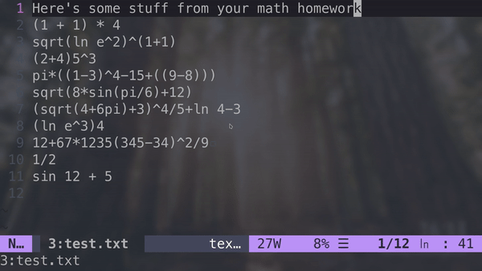

## vim-calc: A Calculator in Vim

#### Introduction
`vim-calc` is a fully functional calculator that you might feel missing in `Vim`.




#### Usage
Do **`:call Calc()`** inside vim to calculate the math equation in the current line (`vim-calc` will tell you if there's any error in terms of the equation within the current line)

Or, if you want a key-binding, add this to your `vimrc`/`init.vim`:
```vim
nnoremap <LEADER>a :call Calc()<CR>
```

Now, you can press `LEADER` and `a` to calculate!

#### Installation
Install `vim-calc` with [vim-plug](https://github.com/junegunn/vim-plug):
```vim
Plug 'theniceboy/vim-calc'
```

#### Contributing
This plugin is **under development** so if you found a bug or have a suggestion, please **DO NOT HESITATE** to [file an issue](https://github.com/theniceboy/vim-calc/issues/new), submit a Pull Request, or email me!

#### License
MIT
